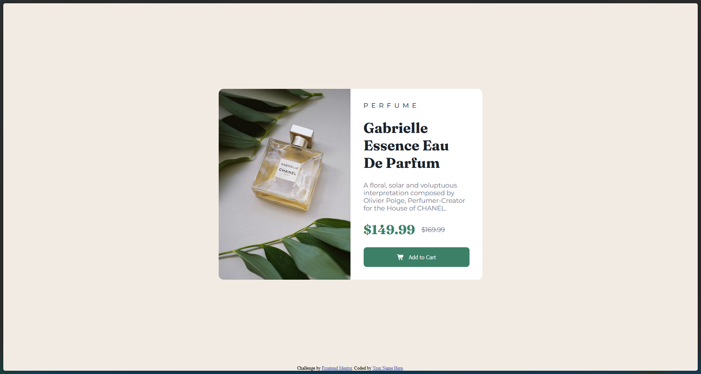

# Frontend Mentor - Product preview card component

Solution to the [Product preview card component challenge on Frontend Mentor](https://www.frontendmentor.io/challenges/product-preview-card-component-GO7UmttRfa).

## Table of contents

- [Overview](#overview)
- [Links](#links)
- [My process](#my-process)
  - [Built with](#built-with)
  - [What I learned](#what-i-learned)
  - [Useful resources](#useful-resources)
- [Acknowledgments](#acknowledgments)

## Overview

### The challenge

Build a responsive product preview card that matches the provided design and adapts to different screen sizes. Include hover/focus states for interactive elements.

### Screenshot

## Links

- Solution URL: [(add your repository link)](https://github.com/DanielPomboDev/product-preview-component.git)
- Live Site URL: https://product-preview-component-fawn-kappa.vercel.app/

## My process

### Built with

- HTML5
- Sass
- Font Awesome
- Google Fonts
- Flexbox
- Mobile-first workflow

### What I learned

Implemented responsive breakpoints and swapped desktop/mobile assets via CSS. Practiced structuring Sass variables and nesting for maintainable styles.

### Useful resources

- Sass — https://sass-lang.com/
- Google Fonts — https://fonts.google.com/
- Font Awesome — https://fontawesome.com/

## Acknowledgments
Thanks to Frontend Mentor for the challenge and design brief that guided this project.